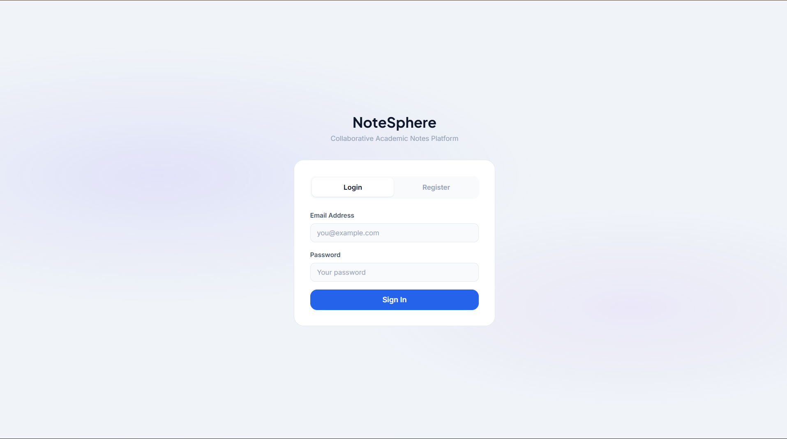
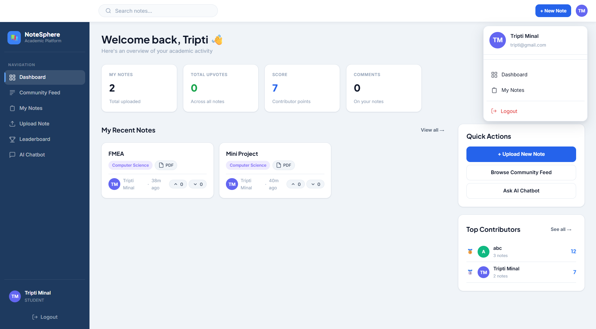
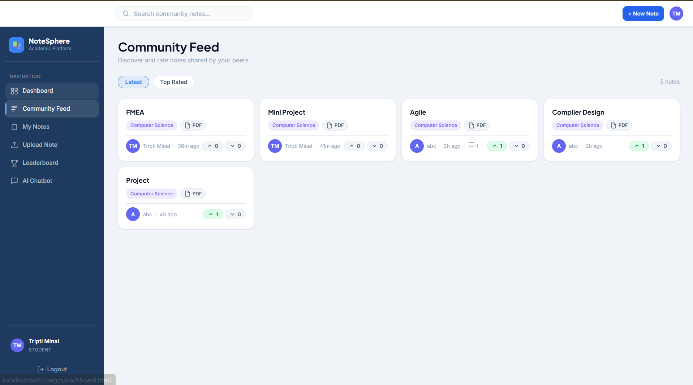
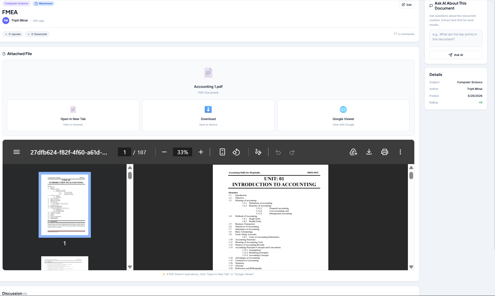
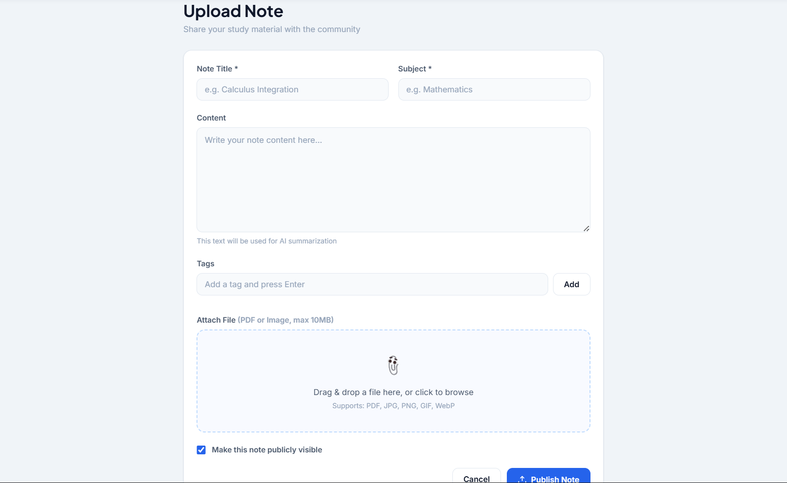
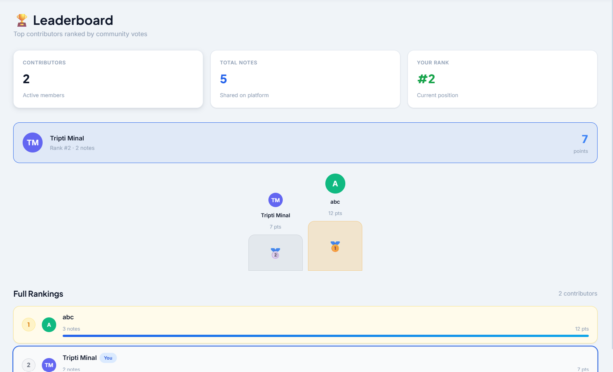
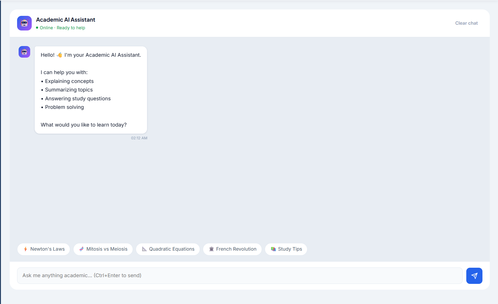

# NoteSphere – Collaborative Notes Sharing Platform

##  Project Description

NoteSphere is a full-stack collaborative notes sharing platform that enables users to upload, manage, search, and share study notes efficiently. The platform provides secure authentication, cloud-based file storage, OCR-powered text extraction, an AI chatbot assistant, and community-driven learning features.

---

## 🛠️ Technology Stack & Tools Used

### Frontend

- HTML5
- CSS3
- JavaScript (ES6+)

### Backend

- Java
- Spring Boot
- Spring Security
- JWT Authentication
- REST APIs

### Database

- MongoDB

### Cloud & External Services

- Cloudinary (Cloud Storage)
- OCR Integration (Text Extraction)
- Grok AI API (AI Chatbot)

### Development Tools

- IntelliJ IDEA / VS Code
- Postman
- Git & GitHub

---

##  Features & Functionalities Implemented

### Authentication & Security

- User Registration & Login
- JWT-based Authentication & Authorization
- Protected API Endpoints

### Notes Management

- Upload Notes/Documents
- View Notes
- Delete Notes
- Manage Uploaded Notes

### Cloud Storage

- Cloudinary integration for secure cloud-based file storage
- Efficient document handling

### OCR & Search

- OCR-based text extraction from uploaded notes
- Search notes using extracted content
- Improved accessibility and content discoverability

### Collaboration & Community

- Share notes with other users
- Community Feed for collaborative learning
- User interaction through shared study resources

### Leaderboard System

- User leaderboard based on platform engagement
- Encourages participation and community contribution

### AI Chatbot Assistant

- Integrated AI chatbot powered by **Grok AI**
- Assists users with queries, study help, and platform guidance

### Backend Functionalities

- RESTful API development
- MongoDB database integration
- Validation and exception handling

---

##  Installation / Execution Steps

### Prerequisites

Make sure the following are installed:

- Java JDK 17+
- Maven
- MongoDB
- Git
- VS Code / IntelliJ IDEA

---

### 1. Clone Repository

```bash
git clone https://github.com/your-username/NoteSphere.git
cd NoteSphere
```

---

### 2. Backend Setup

Configure `application.properties`:

```properties
spring.data.mongodb.uri=mongodb://localhost:27017/notesphere

jwt.secret=your_jwt_secret

cloudinary.cloud_name=your_cloud_name
cloudinary.api_key=your_api_key
cloudinary.api_secret=your_api_secret

grok.api.key=your_grok_api_key
```

Run backend:

```bash
mvn spring-boot:run
```

Backend runs on:

```text
http://localhost:8080
```

---

### 3. Database Setup

Start your MongoDB server locally.

The `notesphere` database will be created automatically when the application runs.

---

### 4. Frontend Setup

Navigate to frontend directory.

For HTML/CSS/JS frontend:

```bash
Open index.html in browser
```

Or use **Live Server** in VS Code.

---

### 5. Access Application

Frontend:

```text
http://localhost:5500
```

Backend API:

```text
http://localhost:8080/api
```

---

# 📸 Project Screenshots

## Authentication Page



## Dashboard Page



## Community Feed Page



## Note Details Page



## Add Note Page



## Leaderboard Page



## Chatbot Page


